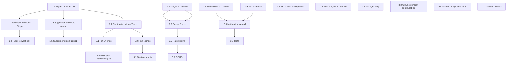

# Plan d'implémentation — YouTube TrendHunter

> Plan d'action détaillé issu de la revue de code (REVIEW.md).
> Priorité : P0 (immédiat) → P1 (urgent) → P2 (important) → P3 (souhaitable).

---

## P0 — Corrections bloquantes

### 0.1 Aligner le provider Prisma (MySQL vs PostgreSQL)

**Problème :**
- `prisma/schema.prisma` déclare `provider = "postgresql"`
- `scripts/setup-mysql.js` configure une base **MySQL**
- `README.md` annonce MySQL
- `PLAN.md` annonce PostgreSQL

**Action :**
1. Décider du moteur cible. Recommandation : **PostgreSQL** (plus adapté aux features array `String[]`, mieux supporté par Vercel/Neon, le plan original).
2. Si PostgreSQL :
   - Supprimer ou réécrire `scripts/setup-mysql.js` → `scripts/setup-postgres.js`
   - Mettre à jour `README.md` → PostgreSQL
   - Mettre à jour tous les scripts qui référencent MySQL (`start-dev-with-mailhog.js`, `start-dev-complete.js`)
3. Si MySQL :
   - Changer `provider = "mysql"` dans `schema.prisma`
   - Remplacer les `String[]` par une table jointe ou un champ JSON
   - Adapter les seeds et requêtes

**Fichiers impactés :**
- `prisma/schema.prisma`
- `scripts/setup-mysql.js`
- `scripts/start-dev-with-mailhog.js`
- `scripts/start-dev-complete.js`
- `README.md`
- `PLAN.md`

**Tests :** `npx prisma db push` doit réussir, `npx prisma db seed` doit insérer les données sans erreur.

---

### 0.2 Ajouter une contrainte unique composite sur Trend

**Problème :**
- `prisma/seed.ts:138-148` utilise `trend.create()` avec un `.catch()` silencieux pour éviter les doublons
- Le schema n'a pas de `@@unique([title, nicheId])` sur Trend

**Action :**
1. Ajouter dans `model Trend` de `schema.prisma` :
   ```prisma
   @@unique([title, nicheId])
   ```
2. Remplacer le `create()` + `.catch()` dans le seed par un `upsert()` propre.

**Fichiers impactés :**
- `prisma/schema.prisma`
- `prisma/seed.ts`

**Tests :** Lancer `npx prisma db push` (doit créer l'index), exécuter le seed deux fois (pas de doublons, pas d'erreur).

---

### 0.3 Supprimer le mot de passe MySQL en dur

**Problème :**
- `scripts/setup-mysql.js` contient `root` / `azerty123` en clair

**Action :**
1. Remplacer par des variables d'environnement lues depuis `.env` ou `.env.local`.
2. Ajouter un prompt interactif si non définies.
3. Si le script est conservé (voir 0.1), appliquer la correction avant tout.

**Fichiers impactés :**
- `scripts/setup-mysql.js`

---

## P1 — Corrections urgentes

### 1.1 Sécuriser le webhook Stripe (status ACTIVE forcé)

**Problème :**
- `src/app/api/stripe/webhook/route.ts:69-82` — le handler `customer.subscription.updated` force `status: "ACTIVE"` sans vérifier le statut réel renvoyé par Stripe.
- Un abonnement en `past_due`, `incomplete` ou `unpaid` sera marqué actif dans la BDD.

**Action :**
1. Ajouter une fonction de mapping des statuts Stripe → statuts Prisma :
   ```typescript
   function mapStripeStatus(stripeStatus: string): SubscriptionStatus {
     switch (stripeStatus) {
       case "active": return "ACTIVE"
       case "past_due": return "PAST_DUE"
       case "canceled": return "CANCELED"
       case "incomplete": return "INCOMPLETE"
       case "trialing": return "TRIALING"
       default: return "ACTIVE"
     }
   }
   ```
2. Appliquer cette fonction dans les handlers :
   - `checkout.session.completed` (ligne 40)
   - `invoice.payment_succeeded` (ligne 63)
   - `customer.subscription.updated` (ligne 78)
3. Typer correctement les événements Stripe au lieu d'utiliser `as any`.

**Fichiers impactés :**
- `src/app/api/stripe/webhook/route.ts`

**Tests :** Simuler chaque type d'événement Stripe avec `stripe-test-webhooks.js` et vérifier le statut en base.

---

### 1.2 Ajouter une validation Zod du retour Claude

**Problème :**
- `src/lib/trend-scorer.ts:56` — `JSON.parse(text)` peut planter ou retourner des données invalides.
- Aucune garantie que le JSON contienne les champs attendus avec les bons types.

**Action :**
1. Créer un schéma Zod pour le score :
   ```typescript
   import { z } from "zod"

   const TrendScoreSchema = z.object({
     score: z.number().int().min(0).max(100),
     status: z.enum(["EMERGING", "GROWING", "PEAK", "FADING"]),
     contentAngles: z.array(z.string()).min(1).max(5),
     reasoning: z.string().min(1),
   })
   ```
2. Remplacer `JSON.parse(text) as TrendScore` par :
   ```typescript
   const parsed = JSON.parse(text)
   const result = TrendScoreSchema.safeParse(parsed)
   if (!result.success) throw new Error("Réponse Claude invalide : " + result.error.message)
   return result.data
   ```
3. Supprimer l'interface `TrendScore` manuelle (redondante avec Zod).

**Fichiers impactés :**
- `src/lib/trend-scorer.ts`

---

### 1.3 Implémenter un singleton Prisma global

**Problème :**
- `src/lib/prisma.ts` : `new PrismaClient({})` sans `globalThis` caching.
- En dev avec hot-reload, des centaines d'instances Prisma sont créées.

**Action :**
```typescript
import { PrismaClient } from "@prisma/client"

const globalForPrisma = globalThis as unknown as {
  prisma: PrismaClient | undefined
}

export const prisma = globalForPrisma.prisma ?? new PrismaClient({})

if (process.env.NODE_ENV !== "production") globalForPrisma.prisma = prisma
```

**Fichiers impactés :**
- `src/lib/prisma.ts`

---

### 1.4 Remplacer les `any` du webhook Stripe par des types

**Problème :**
- 4 occurrences de `as any` dans `stripe/webhook/route.ts` qui masquent les vrais types Stripe.

**Action :**
1. Typer l'event avec `Stripe.Event` (fourni par le SDK Stripe).
2. Typer les objets métier : `Stripe.Checkout.Session`, `Stripe.Invoice`, `Stripe.Subscription`.
3. Plus besoin de `as any` — tout est typé automatiquement par `event.data.object`.

**Fichiers impactés :**
- `src/app/api/stripe/webhook/route.ts`

---

### 1.5 Supprimer les scripts destructeurs gh.sh / gh.ps1

**Problème :**
- `gh.sh` et `gh.ps1` font un `git push -f origin main` + `git gc --aggressive --prune=all`.
- Risque de perte d'historique catastrophique.

**Action :**
1. Supprimer les fichiers ou les remplacer par des scripts non destructeurs (ex. `git push origin main` simple).
2. Ajouter un garde-fou : confirmation interactive avant force push.

**Fichiers impactés :**
- `gh.sh`
- `gh.ps1`

---

## P2 — Implémentations importantes

### 2.1 Finir la page Alertes (`/alerts`)

**Problème :**
- Page statique. Affiche « Aucune alerte configurée » et un bouton "Créer une alerte" sans action.

**Action (dans `src/app/(dashboard)/alerts/page.tsx`) :**
1. Ajouter un formulaire de création d'alerte avec :
   - Type : `SCORE_THRESHOLD` / `DAILY_DIGEST` / `SPIKE`
   - Seuil (nombre, pour `SCORE_THRESHOLD`)
   - Canal : `EMAIL` / `WEBHOOK`
   - Niche (optionnel, liste déroulante)
2. Créer une server action `createAlert(formData)`.
3. Afficher la liste des alertes existantes avec possibilité de supprimer.
4. Ajouter un bouton toggle actif/inactif.

**Nouveaux fichiers :**
- `src/components/dashboard/alert-form.tsx` (client component)
- `src/components/dashboard/alert-list.tsx`

**Fichiers impactés :**
- `src/app/(dashboard)/alerts/page.tsx`

---

### 2.2 Finir la page Niches (`/niches`)

**Problème :**
- Les boutons "Suivre" sont affichés mais n'ont pas de server action attachée.

**Action (dans `src/app/(dashboard)/niches/page.tsx`) :**
1. Créer deux server actions :
   - `followNiche(nicheId: string)`
   - `unfollowNiche(nicheId: string)`
2. Les boutons "Suivre" deviennent des `<form>` avec `action` pointant vers ces server actions.
3. Ajouter un bouton "Retirer" avec icône `Trash2` sur les niches suivies.
4. Gérer la limite de niches selon le plan (FREE → 1 max).

**Fichiers impactés :**
- `src/app/(dashboard)/niches/page.tsx`

---

### 2.3 Ajouter le cache Redis (Upstash)

**Problème :**
- `@upstash/redis` installé mais jamais utilisé.
- Chaque requête `/api/trends` et page dashboard tape directement Prisma.

**Action :**
1. Créer `src/lib/redis.ts` :
   ```typescript
   import { Redis } from "@upstash/redis"

   export const redis = new Redis({
     url: process.env.UPSTASH_REDIS_REST_URL!,
     token: process.env.UPSTASH_REDIS_REST_TOKEN!,
   })
   ```
2. Créer un helper de cache dans `src/lib/cache.ts` :
   ```typescript
   export async function getOrSet<T>(
     key: string,
     fetch: () => Promise<T>,
     ttl: number = 300 // 5 minutes
   ): Promise<T> {
     const cached = await redis.get<T>(key)
     if (cached) return cached
     const data = await fetch()
     await redis.set(key, data, { ex: ttl })
     return data
   }
   ```
3. Appliquer le cache sur :
   - `api/trends/route.ts` — cacher les tendances par niche
   - `dashboard/page.tsx` — cacher les tendances et la liste des niches
   - `extension/trends/route.ts` — cacher les tendances

**Nouveaux fichiers :**
- `src/lib/redis.ts`
- `src/lib/cache.ts`

**Fichiers impactés :**
- `src/app/api/trends/route.ts`
- `src/app/(dashboard)/dashboard/page.tsx`
- `src/app/api/extension/trends/route.ts`

---

### 2.4 Ajouter un fichier `.env.example`

**Problème :**
- Aucun fichier `.env.example` à la racine.
- Les scripts référencent des variables implicitement.

**Action :**
Créer `.env.example` contenant TOUTES les variables nécessaires :

```env
# Base de données
DATABASE_URL="postgresql://..."

# Auth (NextAuth)
AUTH_SECRET="..."
AUTH_GOOGLE_ID="..."
AUTH_GOOGLE_SECRET="..."

# Stripe
STRIPE_SECRET_KEY="..."
STRIPE_WEBHOOK_SECRET="..."
NEXT_PUBLIC_STRIPE_PUBLISHABLE_KEY="..."
STRIPE_PRO_PRICE_ID="..."
STRIPE_TEAM_PRICE_ID="..."

# IA
ANTHROPIC_API_KEY="..."

# Cache (Upstash)
UPSTASH_REDIS_REST_URL="..."
UPSTASH_REDIS_REST_TOKEN="..."

# Email (Resend)
RESEND_API_KEY="..."

# App
NEXT_PUBLIC_APP_URL="http://localhost:3000"
```

**Nouveaux fichiers :**
- `.env.example`

---

### 2.5 Implémenter les notifications email (Resend)

**Problème :**
- `resend` installé dans `package.json` mais pas utilisé.
- Aucune notification pour les alertes de tendances.

**Action :**
1. Créer `src/lib/email.ts` :
   ```typescript
   import { Resend } from "resend"
   export const resend = new Resend(process.env.RESEND_API_KEY!)
   ```
2. Créer un template email basique pour les alertes.
3. (Optionnel) Créer une route API `/api/email/test` pour le debug.

**Nouveaux fichiers :**
- `src/lib/email.ts`
- `src/emails/trend-alert.tsx` (template React Email)

---

### 2.6 Ajouter `/api/trends/[id]` et `/api/niches`

**Problème :**
- PLAN.md liste ces endpoints mais ils n'existent pas.

**Action :**
1. Créer `src/app/api/trends/[id]/route.ts` :
   - GET : détail d'une tendance
   - (Optionnel) DELETE : supprimer une tendance (admin)
2. Créer `src/app/api/niches/route.ts` :
   - GET : lister toutes les niches
   - POST : créer une niche (admin)

---

### 2.7 Ajouter le rate limiting

**Problème :**
- Aucune protection contre les abus sur les routes API.

**Action :**
1. Créer `src/lib/rate-limit.ts` avec Upstash Redis :
   ```typescript
   import { redis } from "./redis"

   export async function rateLimit(
     identifier: string,
     maxRequests: number = 10,
     window: number = 60 // secondes
   ): Promise<{ success: boolean }> {
     const key = `ratelimit:${identifier}`
     const current = await redis.incr(key)
     if (current === 1) await redis.expire(key, window)
     return { success: current <= maxRequests }
   }
   ```
2. Appliquer sur toutes les routes API sensibles :
   - `/api/trends`
   - `/api/extension/trends`
   - `/api/extension/auth`
   - `/api/stripe/checkout`
   - `/api/stripe/portal`

---

## P3 — Améliorations souhaitables

### 3.1 Mettre à jour PLAN.md ou le supprimer

**Problème :**
- PLAN.md (3069 lignes) contient de nombreuses sections non implémentées, des incohérences avec le code réel.

**Action :**
1. Option A : Réécrire PLAN.md pour refléter l'état actuel + les prochaines étapes (recommandé).
2. Option B : Supprimer PLAN.md et utiliser REAMDE.md + IMPLEMENTATION_PLAN.md comme sources de vérité.

### 3.2 Corriger `lang="en"` dans le layout racine

**Problème :**
- `src/app/layout.tsx` a `lang="en"` mais 100% de l'UI est en français.

**Action :**
- Changer `lang="en"` → `lang="fr"` dans `src/app/layout.tsx`.

### 3.3 Rendre les URLs de l'extension configurables

**Problème :**
- `extension/background.js` et `extension/sidebar/index.html` ont `http://localhost:3000` en dur.

**Action :**
1. Créer un système de build simple (ou un fichier de config) pour injecter l'URL de l'API.
2. Par défaut : `http://localhost:3000` en dev, `https://trendhunter.app` en prod.
3. Option : utiliser le stockage `chrome.storage.sync` pour configurer l'URL depuis l'UI.

### 3.4 Finir le content script de l'extension

**Problème :**
- `extension/content.js` = `console.log("TrendHunter loaded")` uniquement.

**Action :**
1. Analyser la page YouTube pour extraire :
   - Titres des vidéos tendances
   - Métriques (vues, likes)
2. Envoyer les données à l'extension via `chrome.runtime.sendMessage`.
3. Afficher un badge de score TrendHunter à côté des vidéos.

### 3.5 Améliorer l'extension sidebar (contentAngles)

**Problème :**
- `extension/sidebar/app.js` affiche les tendances mais pas les `contentAngles` (pourtant envoyés par l'API).

**Action :**
- Ajouter un affichage des angles de contenu dans le rendu des tendances :

### 3.6 Ajouter un système de tests

**Problème :**
- Aucun test dans le projet (ni unitaire, ni intégration, ni e2e).

**Action :**
1. Installer Vitest :
   ```bash
   npm install -D vitest @testing-library/react @testing-library/jest-dom
   ```
2. Ajouter un script `test` dans `package.json`.
3. Créer des tests pour :
   - `src/lib/plan-check.ts` (logique métier)
   - `src/lib/utils.ts` (utility)
   - `src/components/ui/button.tsx` (composant)
   - `src/app/api/stripe/webhook/route.ts` (route API)
4. Créer un test d'intégration pour le webhook Stripe.

### 3.7 Implémenter la gestion admin

**Problème :**
- PLAN.md prévoit un dashboard admin avec gestion des utilisateurs et des niches.
- Aucune implémentation.

**Action :**
1. Ajouter un rôle `ADMIN` dans l'enum `Plan` ou créer un champ `role` sur User.
2. Créer `src/app/(admin)/` avec route guard.
3. Pages : liste utilisateurs, gestion niches, vue globale des tendances.

### 3.8 Gérer le refresh / rotation des tokens API

**Problème :**
- Les tokens API sont stockés en clair.
- Pas d'expiration automatique.
- Régénérer un token détruit tous les précédents.

**Action :**
1. Ajouter une date d'expiration configurable sur les tokens.
2. Ne pas supprimer tous les tokens lors de la génération — permettre plusieurs tokens par utilisateur.
3. Ajouter la possibilité de nommer/révoquer des tokens individuellement.

### 3.9 Ajouter une API CORS configurable

**Problème :**
- Pas de gestion CORS, l'extension communique avec l'API sans en-têtes CORS parce que le backend Next.js les gère implicitement.

**Action :**
1. Créer `src/lib/cors.ts` :
   ```typescript
   export const corsHeaders = {
     "Access-Control-Allow-Origin": process.env.NEXT_PUBLIC_APP_URL ?? "http://localhost:3000",
     "Access-Control-Allow-Methods": "GET, POST, OPTIONS",
     "Access-Control-Allow-Headers": "Content-Type, Authorization",
   }
   ```
2. Ajouter les headers CORS sur toutes les routes API.
3. Gérer les requêtes OPTIONS (preflight) pour l'extension Chrome.

---

## Résumé des priorités

| Priorité | Tâches | Effort estimé |
|----------|--------|---------------|
| **P0** | 3 corrections bloquantes | 1 jour |
| **P1** | 5 corrections urgentes | 2 jours |
| **P2** | 7 implémentations importantes | 5 jours |
| **P3** | 9 améliorations souhaitables | 5 jours |
| **Total** | **24 tâches** | **~13 jours** |

---

## Dépendances entre tâches



---

*Plan généré le 4 juin 2026 depuis REVIEW.md.*
