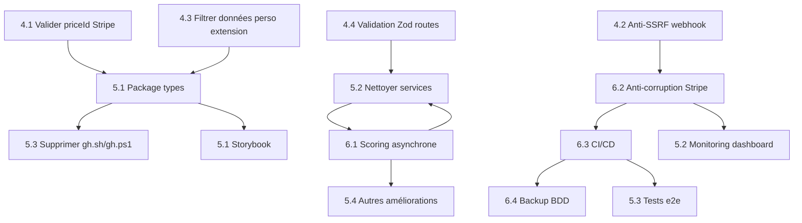

# Plan d'implémentation — YouTube TrendHunter

> **Date :** 9 juin 2026
> **État :** Sprints 1-2-3 terminés (REVIEW.md → 204 tests, score sécurité ~8/10)
> **Prochaine phase :** Sprints 4-5-6

---

## SOMMAIRE

1. [Contexte et prérequis](#1-contexte-et-prérequis)
2. [Sprint 4 — Correctifs sécurité ouverts](#2-sprint-4--correctifs-sécurité-ouverts)
3. [Sprint 5 — Court terme (semaine 1-2)](#3-sprint-5--court-terme-semaine-1-2)
4. [Sprint 6 — Moyen terme (mois 1-2)](#4-sprint-6--moyen-terme-mois-1-2)
5. [Horizon long terme (mois 3-6)](#5-horizon-long-terme-mois-3-6)
6. [Dépendances entre sprints](#6-dépendances-entre-sprints)
7. [Annexe : état des lieux après Sprints 1-2-3](#7-annexe-état-des-lieux-après-sprints-1-2-3)

---

# 1. Contexte et prérequis

## 1.1 Ce qui a déjà été fait

| Phase | Contenu | Statut |
|-------|---------|--------|
| Sprint 1 | 7 correctifs sécurité critiques (password MySQL, hash tokens SHA-256, webhook Stripe, validation Zod Claude, upsert seed, accessibilité `lang="fr"`, limites plan API) | ✅ |
| Sprint 2 | Cache Redis (5 endpoints), pagination cursor-based (3 endpoints), rate limiting (6 routes), retry+timeout (Stripe, Anthropic), suppression `feature-flags.disabled/`, `.env.example` complété, format d'erreur API uniforme | ✅ |
| Sprint 3 | Services layer (5 fichiers), RED metrics + proxy.ts + admin endpoint, types unifiés web/extension (4 fichiers), singleton Prisma (déjà fait), 204 tests (déjà fait), pages placeholders admin/alertes/niches (déjà fonctionnelles) | ✅ |

## 1.2 Stack technique actuelle

- **Frontend :** Next.js 16 (App Router), React 19, Tailwind CSS 4
- **Backend :** Next.js API Routes, Prisma 6 ORM, PostgreSQL
- **Auth :** NextAuth v5 (database sessions), Google OAuth
- **Paiement :** Stripe (checkout, webhooks, portal)
- **IA :** Anthropic Claude (scoring tendances)
- **Cache :** Upstash Redis (TTL, rate limiting, locks)
- **Email :** Resend (alertes, templates React Email)
- **Monitoring :** Sentry (erreurs), PostHog (analytics), RED metrics (in-memory)
- **Extension :** WXT (Chrome extension, Vue.js sidebar)
- **Infra :** pnpm workspaces, Turborepo, Vercel (déploiement)

## 1.3 Scores actuels

| Métrique | Avant | Après Sprints 1-2-3 |
|----------|-------|---------------------|
| Architecture | 4/10 | ~7/10 |
| Sécurité | 5/10 | ~8/10 |
| Performance | 4/10 | ~7/10 |
| Maintenabilité | 5/10 | ~7/10 |
| Tests | 0 | 204 (14 fichiers) |
| **Score global** | **4.2/10** | **~7/10** |

---

# 2. Sprint 4 — Correctifs sécurité ouverts

> **Effort total estimé :** 1-2 jours
> **Priorité :** CRITICAL — À faire immédiatement avant toute nouvelle feature

## 4.1 Valider le `priceId` Stripe au checkout

**Problème :** `src/app/api/stripe/checkout/route.ts` accepte n'importe quel `priceId` — un utilisateur pourrait créer un checkout avec un priceId modifié manuellement.

**Action :**
1. Lire la liste des `priceId` autorisés depuis les variables d'environnement (`STRIPE_PRO_PRICE_ID`, `STRIPE_TEAM_PRICE_ID`)
2. Ajouter une validation Zod au body de la requête
3. Vérifier que le `priceId` correspond à un plan connu avant de créer la session Stripe
4. Retourner une erreur 400 claire si le priceId est inconnu

**Fichier impacté :**
- `src/app/api/stripe/checkout/route.ts`

**Test :**
- Envoyer un priceId invalide → 400
- Envoyer un priceId PRO valide → session Stripe créée
- Envoyer un priceId TEAM valide → session Stripe créée

**Critères de succès :**
- Impossible de lancer un checkout avec un priceId modifié
- Message d'erreur explicite si priceId inconnu

---

## 4.2 Anti-SSRF webhook Stripe

**Problème :** Le webhook Stripe à `src/app/api/stripe/webhook/route.ts` utilise `stripe.webhooks.constructEvent()` qui vérifie la signature, mais ne valide PAS que l'événement vient bien des serveurs Stripe.

**Action :**
1. Ajouter une vérification que l'IP source est bien Stripe (vérification réseau côté Vercel/Cloudflare)
2. Option alternative : vérifier que le header `Stripe-Signature` correspond à notre secret ET que l'événement n'a pas déjà été traité (idempotence)
3. Utiliser le `Stripe.Event` typé (plus de `as any`)
4. Ajouter un cache d'idempotence Redis pour éviter le double traitement

**Fichier impacté :**
- `src/app/api/stripe/webhook/route.ts`

**Test :**
- Simuler un webhook avec signature invalide → 400
- Simuler un webhook valide mais déjà traité → 200 (sans effet de bord)
- Simuler un webhook valide → mise à jour BDD correcte

**Critères de succès :**
- Un webhook reçu 2x ne modifie la BDD qu'une seule fois
- Les événements strippés sont rejetés

---

## 4.3 Filtrer les données personnelles dans l'extension

**Problème :** `src/app/api/extension/trends/route.ts` renvoie `user: { name, email }` dans la réponse — l'extension n'a pas besoin des données personnelles du user.

**Action :**
1. Supprimer le champ `user` de la réponse du endpoint `extension/trends`
2. Garder seulement `trends`, `plan`, et `nextCursor`
3. Vérifier que l'extension n'utilise pas `user.name` ou `user.email` côté client

**Fichiers impactés :**
- `src/app/api/extension/trends/route.ts`
- `youtube-trendhunter-extension/entrypoints/background.ts` (vérifier l'usage côté client)

**Test :**
- Appeler le endpoint → la réponse ne contient PAS de champ `user`
- L'extension fonctionne normalement sans ces données

**Critères de succès :**
- Aucune donnée personnelle (nom, email) dans les réponses API de l'extension
- L'extension continue de fonctionner

---

## 4.4 Validation Zod sur les routes manquantes

**Problème :** Certaines routes API n'ont pas de validation d'entrée avec Zod, exposant à des injections et erreurs silencieuses.

**Routes à auditer et sécuriser :**

| Route | Méthode | Risque |
|-------|---------|--------|
| `/api/stripe/portal` | POST | Aucune validation du body |
| `/api/stripe/checkout` | POST | Validation partielle (manque priceId) |
| `/api/user/export` | POST | Pas de validation du format demandé |
| `/api/cron/trends` | POST | Aucune validation du body |
| `/api/extension/analyze` | POST | Validation existante ✅ |
| `/api/trends/refresh` | POST | Validation existante ✅ |

**Action :**
1. Pour chaque route manquante, ajouter une validation Zod du body/query
2. Retourner une erreur 400 avec `api-error.ts` en cas d'échec
3. Ajouter un test unitaire pour chaque schéma

**Fichiers impactés :**
- `src/app/api/stripe/portal/route.ts`
- `src/app/api/stripe/checkout/route.ts` (compléter)
- `src/app/api/user/export/route.ts`
- `src/app/api/cron/trends/route.ts`
- `src/lib/schemas.ts` (ajouter les nouveaux schémas)

**Critères de succès :**
- 100% des routes POST/PUT/PATCH ont une validation Zod
- Les routes GET avec query params ont une validation si nécessaire

---

# 3. Sprint 5 — Court terme (semaine 1-2)

> **Effort total estimé :** 3-5 jours
> **Priorité :** HAUTE

## 5.1 Package partagé `@youtube-trendhunter/types`

**Problème :** Les types sont actuellement copiés entre `youtube-trendhunter-web/src/lib/types/` et `youtube-trendhunter-extension/shared/types/`. Pas de source unique.

**Action :**
1. Créer `packages/youtube-trendhunter-types/` dans le monorepo
2. Déplacer les types partagés :
   - `TrendScore`, `VideoScore`, `TrendInput`, `VideoInput`
   - `PlanType`, `PlanStatus`
   - `PaginatedResponse<T>`, `ApiError`
   - Les types d'API de l'extension (`GetTrendsResponse`, etc.)
3. Mettre à jour les imports dans le web et l'extension
4. Ajouter le package au `tsconfig.json` des deux projets (paths)

**Fichiers impactés :**
- NOUVEAU : `packages/youtube-trendhunter-types/package.json`
- NOUVEAU : `packages/youtube-trendhunter-types/src/index.ts`
- MODIFIÉ : `youtube-trendhunter-web/src/lib/types/index.ts` (re-export du package)
- MODIFIÉ : `youtube-trendhunter-extension/shared/types/index.ts` (re-export du package)
- MODIFIÉ : `pnpm-workspace.yaml` (ajout du nouveau package)

**Tests :**
- `tsc --noEmit` passe dans web et extension
- Les types sont bien accessibles depuis les deux projets

**Critères de succès :**
- Un seul fichier source de vérité pour les types partagés
- Les deux projets importent depuis le même package

---

## 5.2 Nettoyer la dette services restante

**Problème :** Deux fichiers n'ont pas été complètement migrés vers la couche service :

1. **`my-niches/page.tsx`** : la requête `allNiches` avec `include` complexe utilise encore Prisma directement
2. **`plan-check.ts`** : `getUserPlan()` existe maintenant dans `subscription.service.ts` en doublon

**Action :**
1. Migrer la requête `allNiches` dans `niche.service.ts` sous une méthode dédiée
2. Supprimer les fonctions dupliquées de `plan-check.ts` et rediriger les imports
3. Vérifier tous les callers de `plan-check.ts` et mettre à jour les imports
4. Supprimer `plan-check.ts` si toutes les fonctions sont migrées

**Fichiers impactés :**
- `src/lib/services/niche.service.ts` (nouvelle méthode)
- `src/app/(dashboard)/my-niches/page.tsx` (remplacer prisma direct)
- `src/lib/plan-check.ts` (supprimer fonctions dupliquées)
- Tous les fichiers importants de `plan-check.ts` (~20 fichiers à vérifier)

**Callers de `plan-check.ts` à migrer :**

| Fichier | Fonction utilisée | Nouvelle source |
|---------|-------------------|-----------------|
| `api/trends/route.ts` | `getUserPlan`, `PLAN_LIMITS` | `subscription.service` |
| `api/alerts/route.ts` | `getUserPlan`, `PLAN_LIMITS` | `subscription.service` |
| `api/niches/route.ts` | `getUserPlan`, `PLAN_LIMITS` | `subscription.service` |
| `api/niches/[id]/route.ts` | `getUserPlan` | `subscription.service` |
| `api/user/export/route.ts` | `getUserPlan` | `subscription.service` |
| `api/extension/auth/route.ts` | `getUserPlan`, `PLAN_LIMITS` | `subscription.service` |
| `api/extension/trends/route.ts` | `getUserPlan` | `subscription.service` |
| `api/extension/analyze/route.ts` | `getUserPlan` | `subscription.service` |
| `(dashboard)/page.tsx` | `getUserPlan` | `subscription.service` |
| `(dashboard)/home/page.tsx` | `getUserPlan` | `subscription.service` |
| `(dashboard)/my-niches/page.tsx` | `getUserPlan`, `PLAN_LIMITS` | `subscription.service` |
| `(dashboard)/alerts/page.tsx` | `getUserPlan`, `PLAN_LIMITS` | `subscription.service` |
| `(dashboard)/billing/page.tsx` | `getUserPlan` | `subscription.service` |
| `lib/__tests__/get-user-plan.test.ts` | `getUserPlan`, `activateTrial` | `subscription.service` |

**Critères de succès :**
- `plan-check.ts` supprimé sans régression
- Tous les tests passent (get-user-plan.test.ts mis à jour)
- `my-niches/page.tsx` utilise `niche.service.ts` pour toutes ses requêtes

---

## 5.3 Supprimer les scripts destructeurs `gh.sh` / `gh.ps1`

**Problème :** Les scripts `gh.sh` et `gh.ps1` à la racine font un `git push -f origin main` suivi de `git gc --aggressive --prune=all`. Risque catastrophique de perte d'historique.

**Action :**
1. Supprimer `gh.sh`
2. Supprimer `gh.ps1`
3. (Optionnel) Les remplacer par un script non destructeur : `git push origin main`

**Fichiers impactés :**
- `gh.sh`
- `gh.ps1`

**Critères de succès :**
- Plus de risque de force-push accidentel

---

# 4. Sprint 6 — Moyen terme (mois 1-2)

> **Effort total estimé :** 3-4 semaines
> **Priorité :** MOYENNE (sauf Scoring IA = HAUTE)

## 6.1 Scoring IA asynchrone avec file d'attente

**Problème :** `src/lib/trend-scorer.ts` appelle Anthropic Claude **synchronement** pendant une requête API. Si 10 niches sont refreshées en même temps, l'utilisateur attend 10 appels Claude (~30-60s). Sous charge, cela bloque complètement le serveur.

**Solution :** Architecture file d'attente asynchrone

```
[Client] → POST /api/trends/refresh
         → Crée un job en BDD (status: PENDING)
         → Retourne immédiatement 202 { jobId }
         
[Worker] → Lit les jobs PENDING toutes les 30s
         → Appelle Claude pour chaque job
         → Met à jour les tendances + job status: COMPLETED
         
[Client] → GET /api/jobs/{jobId}
         → Retourne status (PENDING | PROCESSING | COMPLETED | FAILED)
         → Si COMPLETED, retourne les tendances
```

**Fichiers à créer/modifier :**

| Fichier | Action |
|---------|--------|
| `prisma/schema.prisma` | Ajouter modèle `Job` (id, type, status, payload, result, createdAt, completedAt) |
| `src/lib/services/job.service.ts` | `createJob()`, `getJob()`, `processNextJobs()` |
| `src/app/api/trends/refresh/route.ts` | Refactor pour créer un job au lieu d'appeler Claude directement |
| `src/app/api/jobs/[id]/route.ts` | Nouveau endpoint pour vérifier le statut |
| `src/lib/workers/trend-scorer.worker.ts` | Worker qui process les jobs (appelé par cron) |
| `src/app/api/cron/process-jobs/route.ts` | Endpoint cron pour déclencher le worker |

**Considérations techniques :**
- Utiliser la BDD PostgreSQL comme file d'attente (pas besoin de Redis Queue dans un premier temps)
- Lock optimiste via `status: PENDING` + `updatedAt < now() - 5min` pour éviter le double-processing
- Timeout de 60s par job Claude
- Notification via webhook ou polling depuis le frontend

**Tests :**
- Créer un job → status PENDING
- Process le job → status PROCESSING → COMPLETED
- Timeout → status FAILED
- Polling GET /api/jobs/{id} → retourne le bon statut

**Critères de succès :**
- `POST /api/trends/refresh` retourne en < 100ms (vs 30s aujourd'hui)
- Possibilité de suivre la progression côté frontend
- Résilience : si le worker crashe, les jobs sont récupérés après timeout

---

## 6.2 Anti-corruption layer Stripe

**Problème :** Le code Stripe est dispersé dans plusieurs fichiers et typé avec `as any`. Changer de provider de paiement nécessiterait de tout réécrire.

**Action :**
1. Créer une abstraction `PaymentProvider` :

```typescript
// src/lib/payment/provider.ts
export interface PaymentProvider {
  createCheckoutSession(params: CheckoutParams): Promise<CheckoutResult>
  createPortalSession(params: PortalParams): Promise<string>
  handleWebhook(event: unknown): Promise<WebhookResult>
  retrieveSubscription(id: string): Promise<SubscriptionData>
  cancelSubscription(id: string): Promise<void>
}

// src/lib/payment/stripe-adapter.ts
export class StripeAdapter implements PaymentProvider { ... }
```

2. Déplacer toute la logique Stripe existante dans l'adaptateur :
   - `src/app/api/stripe/checkout/route.ts` → `stripe-adapter.createCheckoutSession()`
   - `src/app/api/stripe/webhook/route.ts` → `stripe-adapter.handleWebhook()`
   - `src/app/api/stripe/portal/route.ts` → `stripe-adapter.createPortalSession()`

3. Déplacer les types Stripe éparpillés dans l'abstraction

**Fichiers impactés :**

| Fichier | Action |
|---------|--------|
| `src/lib/payment/provider.ts` | NOUVEAU — interface PaymentProvider |
| `src/lib/payment/stripe-adapter.ts` | NOUVEAU — implémentation Stripe |
| `src/lib/payment/map-status.ts` | NOUVEAU — fonction de mapping statuts |
| `src/app/api/stripe/checkout/route.ts` | REFACTOR — utiliser l'adaptateur |
| `src/app/api/stripe/webhook/route.ts` | REFACTOR — utiliser l'adaptateur |
| `src/app/api/stripe/portal/route.ts` | REFACTOR — utiliser l'adaptateur |
| `src/lib/stripe.ts` | DÉPLACER — intégrer dans stripe-adapter.ts |

**Tests :**
- Créer un mock de `PaymentProvider` pour les tests unitaires
- Tester chaque méthode avec des entrées valides/invalides
- Vérifier que le webhook Stripe est correctement parsé

**Critères de succès :**
- 0 `as any` dans le code Stripe
- Toute la logique Stripe encapsulée dans `payment/`
- Changement de provider = changer une seule classe

---

## 6.3 CI/CD — Staging, tests pré-commit, déploiement

**Problème :** Pas d'environnement staging, les tests ne sont pas exécutés automatiquement, pas de CI/CD fiable.

**Action :**

1. **Staging environment :**
   - Créer un projet Vercel staging (branch `staging`)
   - Base de données PostgreSQL staging (Neon free tier)
   - Variables d'environnement staging
   - Déploiement automatique sur push vers `staging`

2. **Tests pré-commit :**
   - Configurer Husky pour exécuter `vitest run` avant chaque commit
   - Configurer lint-staged pour `eslint` + `prettier` sur les fichiers modifiés
   - Ajouter `npm run typecheck` (tsc --noEmit) au pipeline

3. **GitHub Actions :**
   - Workflow `ci.yml` :
     - `pnpm install` → `pnpm lint` → `pnpm typecheck` → `pnpm test`
     - S'exécute sur PR et push vers main/staging
   - Workflow `deploy.yml` :
     - Déploiement staging automatique (branch staging)
     - Déploiement production manuel (tag ou workflow_dispatch)
   - Workflow `security.yml` :
     - Scan des vulnérabilités npm (pnpm audit)
     - Scan des secrets (truffleHog ou gitLeaks)

**Fichiers impactés :**

| Fichier | Action |
|---------|--------|
| `.github/workflows/ci.yml` | NOUVEAU ou MODIFIÉ |
| `.github/workflows/deploy.yml` | NOUVEAU ou MODIFIÉ |
| `.github/workflows/security.yml` | NOUVEAU |
| `.husky/pre-commit` | MODIFIÉ |
| `.husky/pre-push` | NOUVEAU |
| `.lintstagedrc.json` | MODIFIÉ ou NOUVEAU |
| `package.json` (scripts) | MODIFIÉ — ajouter `typecheck`, `test:ci` |
| `vercel.json` | MODIFIÉ — config staging |

**Critères de succès :**
- Un push sur `staging` déclenche automatiquement déploiement + tests
- Un commit ne peut pas passer sans tests verts
- Les dépendances vulnérables sont détectées en CI

---

## 6.4 Backup BDD automatisé + procédure DRP

**Problème :** Aucune sauvegarde de la base de données. En cas de corruption ou de suppression accidentelle, toutes les données sont perdues.

**Action :**

1. **Backup automatisé :**
   - Script `scripts/backup-db.sh` utilisant `pg_dump`
   - Sauvegarde quotidienne vers un bucket S3/Backblaze B2
   - Rétention : 7 jours de sauvegardes quotidiennes, 4 semaines de sauvegardes hebdomadaires
   - Backup avant chaque migration Prisma (`prisma/preHook`)

2. **Procédure DRP (Disaster Recovery Plan) :**
   - Documenter dans `DRP.md` :
     - URLs des services (production, staging)
     - Accès BDD (provider, credentials)
     - Procédure de restauration :
       ```bash
       # 1. Arrêter l'app
       # 2. Restaurer la dernière sauvegarde
       psql DATABASE_URL < backup_2026-06-09.sql
       # 3. Vérifier l'intégrité
       npx prisma db push --accept-data-loss
       # 4. Redémarrer l'app
       # 5. Vérifier les métriques
       ```
     - Contacts d'urgence
     - Temps de restauration estimé (RTO) : 30 min
     - Perte de données maximale acceptable (RPO) : 24h

3. **Vérification mensuelle :**
   - Script de test de restauration sur un environnement isolé
   - Alerte si le backup n'a pas été fait depuis > 48h

**Fichiers impactés :**

| Fichier | Action |
|---------|--------|
| `scripts/backup-db.sh` | NOUVEAU |
| `DRP.md` | NOUVEAU |
| `package.json` | MODIFIÉ — ajouter script `backup` |

**Critères de succès :**
- Backup automatique quotidien fonctionnel
- Procédure documentée testée trimestriellement
- RTO < 30 min, RPO < 24h

---

# 5. Horizon long terme (mois 3-6)

> **Effort total estimé :** 4-8 semaines
> **Priorité :** FAIBLE — à planifier après les sprints 4-5-6

## 5.1 Storybook pour le design system

**Problème :** Le design system (`packages/youtube-trendhunter-ui`) n'est pas documenté. Pas de catalogue visuel des composants.

**Action :**
1. Installer Storybook dans le package UI
2. Documenter tous les composants existants (Button, Card, Badge, Input, etc.)
3. Ajouter des stories pour les variantes, états (loading, error, empty, disabled)
4. Ajouter des tests de régression visuelle (Chromatic ou Percy)

**Fichiers impactés :**
- `packages/youtube-trendhunter-ui/.storybook/` (nouveau)
- `packages/youtube-trendhunter-ui/src/**/*.stories.tsx` (nouveaux)

## 5.2 Monitoring dashboard (métriques RED)

**Problème :** Les métriques RED (Rate, Errors, Duration) existent via `src/lib/observability.ts` mais :
- Pas de persistance (perdu au redémarrage du serveur)
- Pas de visualisation
- Pas d'alertes

**Action :**
1. Stocker les métriques dans Redis (persistance entre les redémarrages)
2. Ajouter des graphiques dans la page `/admin/monitoring`
3. Configurer des alertes :
   - Taux d'erreur > 5% sur 5 min → Slack
   - Latence moyenne > 2s sur un endpoint → Slack
   - pic de requêtes > 1000/min → Slack
4. Dashboard temps réel avec rafraîchissement automatique (SSE ou polling 10s)

**Fichiers impactés :**
- `src/lib/observability.ts` (persistance Redis)
- `src/app/(dashboard)/admin/page.tsx` (onglet Monitoring enrichi)
- `src/lib/services/alert.service.ts` (alertes métier → opérationnelles)

## 5.3 Tests e2e (Playwright)

**Problème :** 204 tests unitaires mais aucun test end-to-end. Les parcours critiques (auth, checkout, dashboard) ne sont pas testés dans leur intégralité.

**Action :**
1. Installer Playwright
2. Tester les parcours critiques :
   - Landing page → inscription → dashboard
   - Checkout Stripe → abonnement PRO → accès aux fonctionnalités
   - Création d'alerte → modification → suppression
   - Refresh des tendances → affichage dans le dashboard
   - Extension Chrome (si possible)
3. Exécuter les tests e2e en CI sur l'environnement staging

**Fichiers impactés :**
- `e2e/` (nouveau dossier)
- `e2e/auth.spec.ts`
- `e2e/checkout.spec.ts`
- `e2e/dashboard.spec.ts`
- `e2e/alerts.spec.ts`
- `.github/workflows/e2e.yml` (nouveau)

## 5.4 Autres améliorations

### 5.4.1 URLs extension configurables
- Remplacer les URLs en dur (`http://localhost:3000`) par une config build
- Utiliser `chrome.storage.sync` pour l'URL de l'API
- Valeurs par défaut : dev → `http://localhost:3000`, prod → `https://trendhunter.app`

### 5.4.2 Content script extension enrichi
- Analyser la page YouTube pour extraire les métriques des vidéos
- Afficher un badge de score TrendHunter à côté des vidéos
- Envoyer les données à la sidebar

### 5.4.3 ContentAngles dans la sidebar extension
- Actuellement les `contentAngles` sont envoyés par l'API mais pas affichés
- Ajouter un affichage dans le rendu des tendances

### 5.4.4 Gestion des tokens API avancée
- Permettre de nommer les tokens
- Filtrer par statut (actif/expiré/révoqué)
- Ajouter un scope par niche
- Interface utilisateur dans `/settings/api`

### 5.4.5 Mettre à jour PLAN.md
- Le fichier `PLAN.md` (3069 lignes) contient des sections non implémentées
- Option A : Réécrire pour refléter l'état actuel
- Option B : Supprimer et utiliser README.md + IMPLEMENTATION_PLAN.md

---

# 6. Dépendances entre sprints



## Ordre d'exécution recommandé

```
Sprint 4 ────────────────────── Sprint 5 ────────────── Sprint 6 ─────────── Long terme
                                                                             
4.1 priceId     ─────→  5.1 Package types     ─────→  6.1 Scoring async    ──→  5.3 Tests e2e
4.2 Anti-SSRF   ─────→                         ─────→  6.2 Anti-corruption  ──→  5.2 Monitoring
4.3 Données     ─────→  5.2 Nettoyer services  ─────→  6.3 CI/CD            ──→  5.1 Storybook
4.4 Zod routes  ─────→  5.3 gh.sh/gh.ps1       ─────→  6.4 Backup BDD       ──→  5.4 Autres
```

---

# 7. Annexe : état des lieux après Sprints 1-2-3

## 7.1 Fichiers créés

| Fichier | Sprint | Objectif |
|---------|--------|----------|
| `src/lib/schemas.ts` (étendu) | 1 | TrendScoreSchema Zod |
| `src/lib/api-error.ts` | 2 | Format d'erreur API uniforme |
| `src/lib/retry.ts` | 2 | `withRetry()` helper avec backoff + timeout |
| `src/lib/services/trend.service.ts` | 3 | Repository Trend |
| `src/lib/services/niche.service.ts` | 3 | Repository Niche |
| `src/lib/services/alert.service.ts` | 3 | Repository Alert |
| `src/lib/services/subscription.service.ts` | 3 | Repository Subscription |
| `src/lib/services/user.service.ts` | 3 | Repository User |
| `src/lib/observability.ts` | 3 | RED metrics collector |
| `src/proxy.ts` | 3 | Next.js 16 proxy (middleware) |
| `src/app/api/admin/metrics/route.ts` | 3 | Endpoint métriques admin |
| `src/lib/types/trend.types.ts` | 3 | Types Trend unifiés |
| `src/lib/types/api.types.ts` | 3 | Types API unifiés |
| `src/lib/types/plan.types.ts` | 3 | Types Plan unifiés |
| `src/lib/types/index.ts` | 3 | Barrel export |

## 7.2 Fichiers modifiés

| Fichier | Sprint | Changement |
|---------|--------|------------|
| `scripts/setup-mysql.js` | 1 | Password → vars d'env |
| `src/lib/api-tokens.ts` | 1 | Hash SHA-256 |
| `src/app/api/stripe/webhook/route.ts` | 1,2 | 7 statuts Stripe + retry |
| `src/lib/trend-scorer.ts` | 1,2,3 | Validation Zod + retry + types |
| `prisma/seed.ts` | 1 | upsert statt create+catch |
| `src/app/layout.tsx` | 1 | `lang="fr"` |
| `src/components/theme-toggle.tsx` | 1 | aria-label |
| `src/components/dashboard/sidebar.tsx` | 1 | aria-label navigation |
| `src/app/api/trends/route.ts` | 1,2,3 | Limites plan + cache + pagination + rate-limit + api-error + services |
| `src/lib/plan-check.ts` | 1,3 | Suppression session shortcut + types |
| `.env.example` | 2 | HEALTH_CHECK_SECRET, ADMIN_EMAILS |
| `src/lib/stripe.ts` | 2 | Timeout + maxNetworkRetries |
| `src/app/(dashboard)/home/page.tsx` | 2,3 | Cache Redis + services |
| `src/app/(dashboard)/my-niches/page.tsx` | 2,3 | Cache Redis + services |
| `src/app/(dashboard)/alerts/page.tsx` | 3 | Services |
| `src/app/(dashboard)/admin/page.tsx` | 3 | Services |
| `src/app/api/niches/route.ts` | 2,3 | Cache + pagination + rate-limit + services |
| `src/app/api/alerts/route.ts` | 2,3 | Rate-limit + services |
| `src/app/api/extension/auth/route.ts` | 2 | Rate-limit |
| `src/app/api/extension/trends/route.ts` | 2,3 | Cache + pagination + services |
| `src/app/api/trends/refresh/route.ts` | 2 | Rate-limit + api-error |
| `src/app/api/niches/[id]/route.ts` | 2 | Rate-limit |
| `src/youtube-trendhunter-extension/shared/types/index.ts` | 3 | JSDoc + consistency |

## 7.3 Fichiers supprimés

| Fichier | Sprint | Raison |
|---------|--------|--------|
| `src/lib/feature-flags.disabled/` (7 fichiers) | 2 | Code mort non utilisé |

## 7.4 Fichiers non modifiés (mais pertinents)

| Fichier | Raison |
|---------|--------|
| `src/lib/prisma.ts` | Singleton déjà implémenté |
| `src/lib/redis.ts` | Stub déjà complet, activé dans Sprint 2 |
| `src/lib/rate-limit.ts` | Stub déjà complet, activé dans Sprint 2 |

## 7.5 Couverture de tests (204 tests)

| Fichier de test | Tests | Couvre |
|-----------------|-------|--------|
| `lib/__tests__/get-user-plan.test.ts` | 12 | getUserPlan + activateTrial |
| `lib/__tests__/trend-scorer.test.ts` | 18 | ScoreTrend + ScoreVideo + Zod + fallbacks |
| `lib/__tests__/plan-check.test.ts` | 9 | PLAN_LIMITS |
| `lib/__tests__/plan-check-extended.test.ts` | 11 | isOnTrial + getTrialDaysRemaining |
| `lib/__tests__/plan-check-integration.test.ts` | 4 | PLAN_LIMITS intégration |
| `lib/__tests__/schemas.test.ts` | 16 | 6 schémas Zod |
| `lib/__tests__/schemas-extended.test.ts` | 10 | trendsRefresh + extensionAuth |
| `lib/__tests__/schemas-trendscore.test.ts` | 18 | TrendScoreSchema |
| `lib/__tests__/api-tokens.test.ts` | 30 | hash, generate, parse, verify, create, revoke, list, cleanup |
| `lib/__tests__/plans.test.ts` | 16 | Plans display data |
| `lib/__tests__/analytics.test.ts` | 20 | User lifecycle, onboarding, events, identify |
| `app/__tests__/layout-accessibility.test.tsx` | 10 | lang, aria, metadata, OpenGraph |
| `components/__tests__/theme-toggle-accessibility.test.tsx` | 10 | aria-label, rôle, clavier |
| `prisma/__tests__/seed.test.ts` | 13 | Upsert, doublons, admin, cleanup |

---

*Plan d'implémentation généré le 9 juin 2026 — basé sur REVIEW.md + Sprints 1-2-3 exécutés.*
